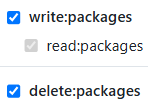

# Création d'un registre de packages NPM sur Github

## Vanilla Javascript

### Création du package

- Créer un fichier `package.json` contenant au minimum
  
  - `"name": "@<scope>/<package_name>"`, `<scope>` correspondant au nom d'utilisateur Github et `<package_name>` au nom donné au package
  
  - `version: 1.0.0`

- [Créer un token d'accès (classic) sur Github](https://github.com/settings/tokens/new) et y assigner les droits suivants :
  
  

- Créer un fichier `.npmrc` à la racine du projet :
  
  ```
  //npm.pkg.github.com/:_authToken=<token>
  @<scope>:registry=https://npm.pkg.github.com
  ```
  
  `<token>` étant le token d'authentification généré précédemment, et `<scope>` le nom d'utilisateur Github

### Lien du package à un repository Github (optionnel)

- Créer un repository Github

- Ajouter la propriété suivante au `package.json` : `"repository": "<github_repository>"`, `<github_repository>` étant l'URL du dépôt Github.

### Publication du package

- Lancer la commande `npm publish` depuis la racine du projet.


